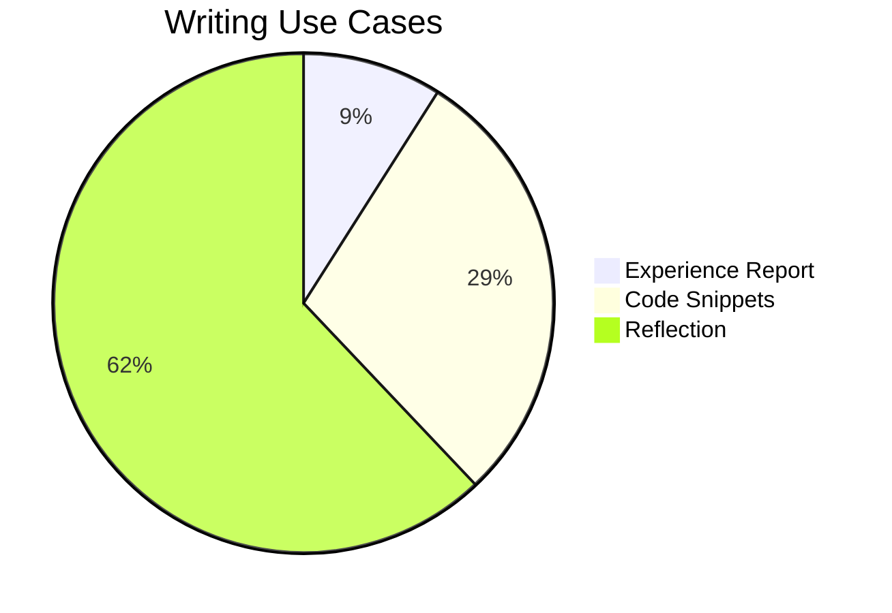
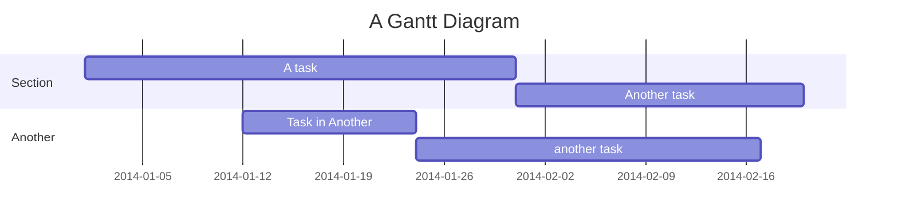

"In ten years you’ll see me as a writer". That is what my 2008 yearbook says. I always wanted to write -- in some form or the other. But I don't write as much as I had wanted in 2008. Take this post as a rite of passing, or as an evolutionary next step from my short-form LinkedIn posts. 

#### Why?

I always found the written word to be a better articulation of my thoughts than the spoken word. Writing fundamentally to me, is a reflection of my thoughts -- organised in a way that long after I have forgotten my passing thoughts, something remains for me to get back to.

Reflecting on things is one way to get self feedback. Looking back is a way to improve myself going forward. Writing about things as I look at them today after my ten years of experience may help you, perhaps it won’t. Perhaps in another ten years, I will see how naive I am today and advise you to do better -- or perhaps not. Perhaps, perhaps, perhaps... But it definitely won't help you or me if what I write never sees the light of day.

Unfortunately most of what I wrote over the years stayed private or got lost -- imposter syndrome is not easy to escape. Fear of being called out, I wouldn’t write at all. After all, you can’t be wrong if you don’t say anything. This changed over the course of 2024. I started with short-form LinkedIn posts, which did not need much scrutiny or proof reading. I got few likes on those posts and that reinforced my loosely held belief that it is better to write than to perfect writing.


#### Breaking the barrier to Writing

I use [Obsidian](https://obsidian.md) to keep day-to-day log. I maintain this static blog built with [Jekyll](https://jekyllrb.com). Both use [Markdown](https://en.wikipedia.org/wiki/Markdown) files but because Markdown is primarily text based, the blog-writing experience on Markdown purely is suboptimal
- Pasting images is not easy
- Text wrapping, bold fonts, italics and live preview requires manual setup
- Pasting links on like [this](https://mourjo.me) needs to be done manually in the Markdown syntax
- No direct support for code formatting
- Markdown tables are not easy to write
- Writing on the go is hard (mobile support is almost always lacking)

None of these are major blockers to writing - but for my writing to flow, the barrier to entry needs to be much lower. This is where Obsidian's excellent user experience comes in.


#### Writing with Obsidian

I am writing this post on Obsidian - with the help of [a simple Python script](https://github.com/mourjo/blog/blob/master/copy_from_obsidian.py), I can migrate this from Obsidian to Jekyll. And that allows me to keep my writing experience entirely on Obsidian.

#### Code formatting

```java
public class HelloWorld {
	public static void main(String args[]) {
		System.out.println("Hello, world!");
	}
}
```

#### Tables

| No  | Topic                      | Description                                                          |
| --- | -------------------------- | -------------------------------------------------------------------- |
| 1   | Obsidian - tips and tricks | Basics of using a note-taking tool                                   |
| 2   | Effective writing          | Quickly jotting notes down that later become full fledged blog posts |

#### Callouts

> [!question] Idea for writing?
> - A [plugin](https://github.com/mourjo/blog/blob/master/_plugins/obsidian_callouts_converter.rb) that converts Obsidian callouts to Jekyll


#### Math
$$P(A∣B)=\frac{P(A \cap B)}{P(B)} $$


#### Diagrams As Code



It’s time I went back to writing. Not for the company or my medium account, but for shorter form, more thoughts than articles. Putting to paper has been part of my thinking process for a while, this is me putting some of that out in the public. I will still write ob medium, but those will be deep technical articles that need much more of my analytical mind. This is for my creative side. To write for the joy of it. 

It was haphazard and I often lost track of what I was writing or lost the motivation or forgot about it later on. Many ideas I thought of are now scattered in the ether. 

I feel happy when I write. But the imposter syndrome, coupled with the barrier to entry breaks the loop entirely. This post is all about getting the second one out of the way. The technical challenges although minor were 
- pasting images 
- Writing experience - text wrapping, expand section, live preview  
- Pasting links 
- Shortcuts like bold and italics


I am taking a step to constructively write more, and mostly in the non-technical sphere.

How I got into Obsidian
Why it is much better than Emacs or Google docs.
One place for all things to write
- Daily journal (also the scratchpad)
- Monthly personal and professional goals
- Todos
- Being able to dump thoughts as they appear sometimes in between work items, sometimes from my phone on the go

How ideas form in my head
- Scratch pad, just a sentence often centered on a larger idea
- Writing is not about the idea, writing is about the presentation
- Convincing an external intelligent being
	- Story telling
	- Without forgetting the original central point
- Ideas if not put down in stone, fizzles away
- Baking of ideas don't happen if they fizzle away
- Best of what I have ever written starts with a random thought spark - which has no story, and is only interesting to me
	- Transient nature of it - If this spark or wave is missed, I will never end up getting back to it
- Packaging it is work that is independent of the core idea and independent of motivation


Details about how
- Watched video about using Obsidian for writing in static site blog posts like mine with Hugo (can be done with Jekyll too)
	- Added [it here](https://github.com/mourjo/blog/blob/master/copy_from_obsidian.py)
	- Obsidian template
	- Images and code
	- Publish pipeline
	- Needs some changes
		- (done) Test code snippets
		- In the python script 
			- Handle scaled images (ones with a `|`)
			- (done) Update it to take as input a single file name (not all)
			- (done) Copy the markdown file 
			- (done) Add `/blog` prefix to url for images
			- (done) Remove spaces in image file name - add images as `<markdown-file-name>-<N>.png` where N is the number of the image so that it is easier to find
		- In Obsidian (done)
			- (done) Rename file to snakecase based on the front matter
			- (done) Add template for mourjo-me blog frontmatter like [[2024-12-04-motivation-is-not-everything]]


Not notion because markdown files are accessible 


```javascript
function toAsciiKebabCase(text) {
  // Normalize the string to remove diacritics and special characters
  const normalized = text.normalize("NFD").replace(/[\u0300-\u036f]/g, "");
  
  // Remove non-alphanumeric characters (except spaces and hyphens)
  const alphanumeric = normalized.replace(/[^a-zA-Z0-9\s-]/g, "");
  
  // Replace spaces and multiple hyphens with a single hyphen
  const kebabCase = alphanumeric
    .trim()
    .replace(/\s+/g, "-")       // Replace spaces with hyphens
    .replace(/-+/g, "-")        // Remove consecutive hyphens
    .toLowerCase();             // Convert to lowercase
  
  return kebabCase;
}

// Example usage
const text = "Hello, World! 123 Café Déjà Vu";
console.log(toAsciiKebabCase(text)); 
// Output: "hello-world-123-cafe-deja-vu"

```


And some python
```python
import os
import re
import sys
import shutil
from pathlib import Path


# Paths
jekyll_posts_dir = "/Users/mourjo/repos/blog/_posts" # path in blog containing posts
attachments_dir = "/Users/mourjo/repos/transpire/attachments" # path in obsidian that contains the images
static_images_dir = "/Users/mourjo/repos/blog/images" # output image path in Jekyll
obsidian_posts_dir = "/Users/mourjo/repos/transpire/personal-notes/mourjo-me-blog/"


def select_file_in_directory(directory):

    if not os.path.isdir(directory):
        print(f"Error: '{directory}' is not a valid directory.")
        return None

    # List files in the directory
    files = sorted([f for f in os.listdir(directory) if os.path.isfile(os.path.join(directory, f))], reverse=True)

    if not files:
        print(f"No files found in directory: {directory}")
        return None

    # Display files and let the user select one
    print("Available files:")
    for index, file in enumerate(files, start=1):
        print(f"{index}: {file}")

    while True:
        try:
            choice = int(input("Enter the number of the file you want to select (or 0 to cancel): "))
            if choice == 0:
                print("No file selected.")
                return None
            elif 1 <= choice <= len(files):
                selected_file = files[choice - 1]
                return os.path.join(directory, selected_file)
            else:
                print("Invalid choice. Please enter a valid number.")
        except ValueError:
            print("Invalid input. Please enter a number.")
        except KeyboardInterrupt:
            return None
    if not os.path.isdir(directory):
        print(f"Error: '{directory}' is not a valid directory.")
        return None


def from_obsidian(filename):
    if filename is None:
       print("\nNo file found")
    elif not(filename.endswith(".md")):
        print("\nMarkdown file names must begin with .md")
    else:
        filename = Path(filename).name
        input_filepath = os.path.join(obsidian_posts_dir, filename)
        output_filepath = os.path.join(jekyll_posts_dir, filename)

        with open(input_filepath, "r") as file:
            content = file.read()

        image_count = 1

        matching_images = re.findall(r'\[\[(([^]]*\.)(jpeg|svg|png|jpg))\]\]', content)
        images = map(lambda img_matches: img_matches[0], matching_images)
        images = sorted(images)

        filename_without_path = os.path.basename(filename)
        filename_without_ext = filename_without_path[:filename_without_path.rfind(".")]


        for image in images:

            index = image.rfind(".")
            before = image[:index]

            after = image[(index + 1):]

            renamed_image = filename_without_ext + "-" + str(image_count) + "." + after
            image_count = image_count + 1

            image_source = os.path.join(attachments_dir, image)
            if os.path.exists(image_source):
                image_output_path = os.path.join(static_images_dir, renamed_image)
                print(f"Copying '{image}' as '{image_output_path}'")
                shutil.copy(image_source, image_output_path)

            markdown_image = f"[Image Description](/blog/images/{renamed_image})"
            content = content.replace(f"[[{image}]]", markdown_image)

        with open(output_filepath, "w") as file:
            file.write(content)

        print("Markdown files processed and images copied successfully.")

if len(sys.argv) != 2:
    from_obsidian(select_file_in_directory(obsidian_posts_dir))
else:
    from_obsidian(sys.argv[1])

```

I can also use math!

$$P(A∣B)=\frac{P(A \cap B)}{P(B)} $$


Emojis!  😁 👾 🎉

Dynamic JS - load whichever library I need - math then needed, code when needed

> [!question] Idea for presentation - question
> Simulate a graph showing likelihood of missing the deadline as the deadline approaches


> [!tip] Idea for presentation - tip
> Simulate a graph showing likelihood of missing the deadline as the deadline approaches


> [!NOTE] Title - note
> Contents


> [!important] Title IMPORTANT
> Contents


> [!example] Title example
> Contents


> [!info] Title info
> Contents


### Tables

| No  | Topic                      | Description                                                          |
| --- | -------------------------- | -------------------------------------------------------------------- |
| 1   | Obsidian - tips and tricks | Basics of using a note-taking tool                                   |
| 2   | Effective writing          | Quickly jotting notes down that later become full fledged blog posts |


