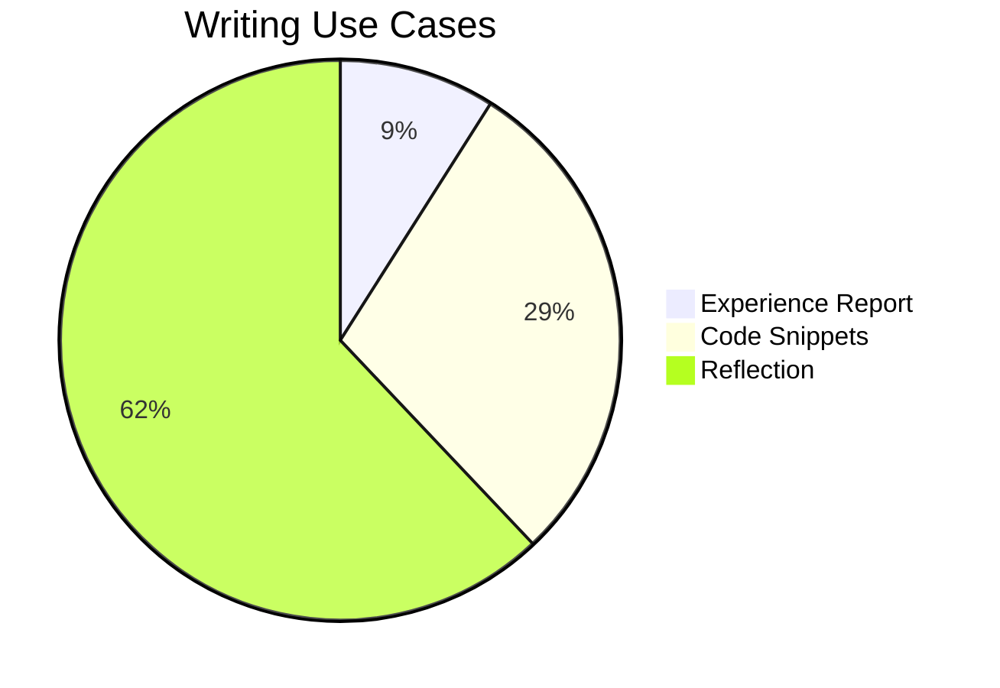

"In ten years you’ll see me as a writer". That is what my 2008 yearbook says. I always wanted to write -- in some form or the other. But I don't write as much as I had wanted in 2008. Take this post as a rite of passing, or as an evolutionary next step from my short-form LinkedIn posts. 

#### Why?

I always found the written word to be a better articulation of my thoughts than the spoken word. Writing fundamentally to me, is a reflection of my thoughts -- organised in a way that long after I have forgotten my passing thoughts, something remains for me to get back to.

Reflecting on things is one way to get self feedback. Looking back is a way to improve myself going forward. Writing about things as I look at them today after my ten years of experience may help you, perhaps it won’t. Perhaps in another ten years, I will see how naive I am today and advise you to do better -- or perhaps not. Perhaps, perhaps, perhaps... But it definitely won't help you or me if what I write never sees the light of day.

Unfortunately most of what I wrote over the years stayed private or got lost -- imposter syndrome is not easy to escape. Fear of being called out, I wouldn’t write at all. After all, you can’t be wrong if you don’t say anything. This changed over the course of 2024. I started with short-form LinkedIn posts, which did not need much scrutiny or proof reading. I got few likes on those posts and that reinforced my loosely held belief that it is better to write than to perfect writing.


#### Breaking the barrier to Writing

I use [Obsidian](https://obsidian.md) to keep day-to-day log. I maintain this static blog built with [Jekyll](https://jekyllrb.com). Both use [Markdown](https://en.wikipedia.org/wiki/Markdown) files but because Markdown is primarily text based, the blog-writing experience on Markdown purely is suboptimal
- Pasting images is not easy
- Text wrapping, bold fonts, italics and live preview requires manual setup
- Pasting links on like [this](https://mourjo.me) needs to be done manually in the Markdown syntax
- No direct support for code formatting
- Markdown tables are not easy to write
- Writing on the go is hard (mobile support is almost always lacking)

None of these are major blockers to writing - but for my writing to flow, the barrier to entry needs to be much lower. This is where Obsidian's excellent user experience comes in.


#### Writing with Obsidian

I am writing this post on Obsidian - with the help of [a simple Python script](https://github.com/mourjo/blog/blob/master/copy_from_obsidian.py), I can migrate this from Obsidian to Jekyll. And that allows me to keep my writing experience entirely on Obsidian.

#### Code formatting

```java
public class HelloWorld {
	public static void main(String args[]) {
		System.out.println("Hello, world!");
	}
}
```

#### Tables

| No  | Topic                      | Description                                                          |
| --- | -------------------------- | -------------------------------------------------------------------- |
| 1   | Obsidian - tips and tricks | Basics of using a note-taking tool                                   |
| 2   | Effective writing          | Quickly jotting notes down that later become full fledged blog posts |

#### Callouts

> [!question] Idea for writing?
> - A [plugin](https://github.com/mourjo/blog/blob/master/_plugins/obsidian_callouts_converter.rb) that converts Obsidian callouts to Jekyll


#### Math
$$P(A∣B)=\frac{P(A \cap B)}{P(B)} $$


#### Diagrams As Code

