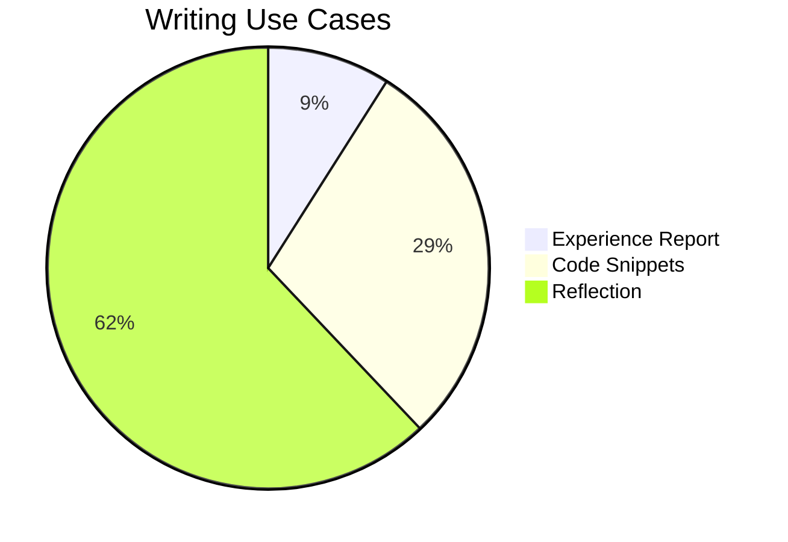

"In ten years you’ll see me as a writer". My 2008 yearbook would be disappointed in how things turned out. But it is the new year and it is never too late to start. 

If I am being honest, though, I have not entirely lost touch with writing -- only that today it serves quite a different purpose. Back in school, I wrote because I found it to be the easiest way of expressing myself. Today, writing has become the fabric for a structured thinking process. 

I do not write as much as I had wanted to in 2008 -- at least not for the joy of it. Take this post as a rite of passing to find my way back to writing for the joy of it -- not long-form technical articles or mindmaps which require a lot of effort and research, but reflections and musings -- an evolutionary next step from my short-form LinkedIn posts. 


# Why Write at all: Active Externalism

Putting pen to paper lays structure to otherwise haphazard thought processes — a structure with a clear narrative that is consumable for others. Engineers do not work in isolation, and in order to collaborate, a structured thinking is key. Writing is one way to put structure to haphazard thoughts.

While at the surface writing does not seem to be a hard requirement of the software engineer's job, structured thinking is. Writing helps convoluted, passing thoughts take a more permanent form, which my future self can come back to -- ideas fleet, written artefacts remain. In fact, the permanence of written artefacts has influenced in setting better goals for myself -- from haphazard maybes to definitive idea execution plans. 

In the 1998 paper ["The extended mind"](https://www.alice.id.tue.nl/references/clark-chalmers-1998.pdf), Clark and Chalmers posit that our human minds go beyond the boundaries of skin and skull -- that elements in our environment play a great role in driving our cognitive processes. 

> Where does the mind stop and the rest of the world begin? The human organism is linked with an external entity in a two-way interaction, creating a coupled system that can be seen as a cognitive system in its own right. All the components in the system play an active causal role, and they jointly govern behaviour in the same sort of way that cognition usually does.

The authors call this active externalism -- an extension of our cognitive processes. Writing in some way has been an extension of my cognitive process, just like the calculator became an integral part of my math classes. Just like me being faster at typing with qwerty keyboards now than writing with my own hands. 

The process of note-taking has become an extension of my thought process.

# Writing for Myself
Reflecting on things is one way to get self feedback. Looking back is a way to improve myself going forward. Writing about things as I look at them today after my ten years of experience may help you, perhaps it won’t. Perhaps in another ten years, I will see how naive I am today and advise you to do better -- or perhaps not. Perhaps, perhaps, perhaps... But it definitely won't help you or me if what I write never sees the light of day. 

Unfortunately most of what I wrote over the years stayed private or got lost -- imposter syndrome is not easy to escape. This changed over the course of 2024. I started with short-form LinkedIn posts, which did not need much scrutiny or proof reading. I got few likes on those posts and that reinforced my loosely held belief that it is better to write than to perfect writing.

# Idea Capturing: Where do Good Ideas come from?
[Good ideas come from hunches](https://www.youtube.com/watch?v=NugRZGDbPFU) - and hunches consistently occur to me when and where I least expect it -- in the middle of the night while getting a glass of water, on the commute back home after a tough day at the office, atop the snowy peaks of the [Austrian Alps](https://mourjo.me/blog/non-tech/2024/12/29/alluring-austria/). 

It is not guaranteed by any stretch of the imagination that I will recall any of the fleeting ideas the next time I sit at the laptop. This is why I started using [Obsidian](https://obsidian.md) to keep a day-to-day log of thoughts on the go -- it simply works on every device I own -- making idea capturing possible anywhere.

# Idea Presenting: Breaking the Barrier to Writing
Writing is not just about the idea, writing is equally about the presentation. "Write without inhibition, edit with clarity", as Jared explains in [this video](https://www.youtube.com/watch?v=ZcljLAmDIY4). Again, Obsidian plays a key role for me here.
 
 I maintain a static blog built with [Jekyll](https://jekyllrb.com). Both use [Markdown](https://en.wikipedia.org/wiki/Markdown) files but because Markdown is primarily a text based format, the blog-writing experience on Markdown is suboptimal:
- Pasting images is not easy -- even less so if it involves the additional step of transferring photos from my mobile phone to my laptop
- Pasting links on like [this](https://mourjo.me) needs to be done in the esoteric Markdown syntax, which breaks the flow of writing
- No direct support for code formatting
- Markdown tables are not easy to work with
- Text wrapping, bold fonts, italics and live preview requires manual setup

I would not like to spend too much time on the mechanics of the writing -- I would much rather spend the time in the narrative of it --  as the New York Times bestseller [Joshua Fields Millburn puts it](https://www.youtube.com/watch?v=Fr5kWGWCcMs) , "if it doesn't push the narrative forward, then it doesn't have the urgency you need to be compelling for your readers".

# The Writing Process

I am writing this post on Obsidian - with the help of [a simple Python script](https://github.com/mourjo/blog/blob/master/copy_from_obsidian.py), I can migrate a file that [looks like this](https://gist.githubusercontent.com/mourjo/3698cef9dc1c9fff79ea98b8f9337f41/raw/7fd22fcfd76f2cfad1e4a1587a01a12a4c36f002/2025-01-06-overcoming-barriers-to-entry-writing-with-obsidian.md) to Jekyll (the idea came from [this video](https://www.youtube.com/watch?v=dnE7c0ELEH8) by NetworkChuck). This script allows me to keep my writing experience entirely on Obsidian. 

Following are a few indications of making writing a joy with Obsidian and publishing to my blog.

### Code Blocks
Most markdown flavours support code blocks, but again, it’s the experience of writing that seals the deal. 

```java
public class HelloWorld {
	public static void main(String args[]) {
		System.out.println("Hello, world!");
	}
}
```

### Tables
Often used but tables in Markdown are notoriously hard to get right, especially in simple text editors. Obsidian’s preview makes tables as friendly as Google docs. Well almost. 

| No  | Topic                      | Description                                                          |
| --- | -------------------------- | -------------------------------------------------------------------- |
| 1   | Obsidian - tips and tricks | Basics of using a note-taking tool                                   |
| 2   | Effective writing          | Quickly jotting notes down that later become full fledged blog posts |

### Mermaid Diagrams 

It is a super power to generate scalable [Mermaid images](https://mermaid.js.org) like this: 




### Informational Callouts
A simple format like Markdown doesn’t support much more than basic formatting. But sometimes I have found myself using call-outs to draw attention to an idea or mark an open question - like the one below. 

> [!question] Idea for writing?
> - A [plugin](https://github.com/mourjo/blog/blob/master/_plugins/obsidian_callouts_converter.rb) that converts Obsidian callouts to Jekyll

### Math
A software engineer is bound to encounter math in some shape or form. But even if you don’t like Math, you have got to admire the LaTex style of mathematical equations: 

$$P(A∣B)=\frac{P(A \cap B)}{P(B)} $$


### Images 

I’m writing this post on my mobile, while pasting an image as I would with my private notes. Without me ever having to transfer it, the same image is copied and published to this blog with [a Python script](https://github.com/mourjo/blog/blob/master/copy_from_obsidian.py).


# Conclusion: Why Writing Matters
Last month I went to Austria with my family -- a much needed break to heaven on Earth. I took down [a few notes](https://mourjo.me/blog/non-tech/2024/12/29/alluring-austria/) about what I want to recall looking back -- and a picture for each day. It has been just a few weeks and I have already started forgetting the details -- that is why writing matters -- **to put a more permanent form to fleeting thoughts.**

Though I do not believe in new year's resolutions, this is a promise and a way forward to writing more in 2025.
